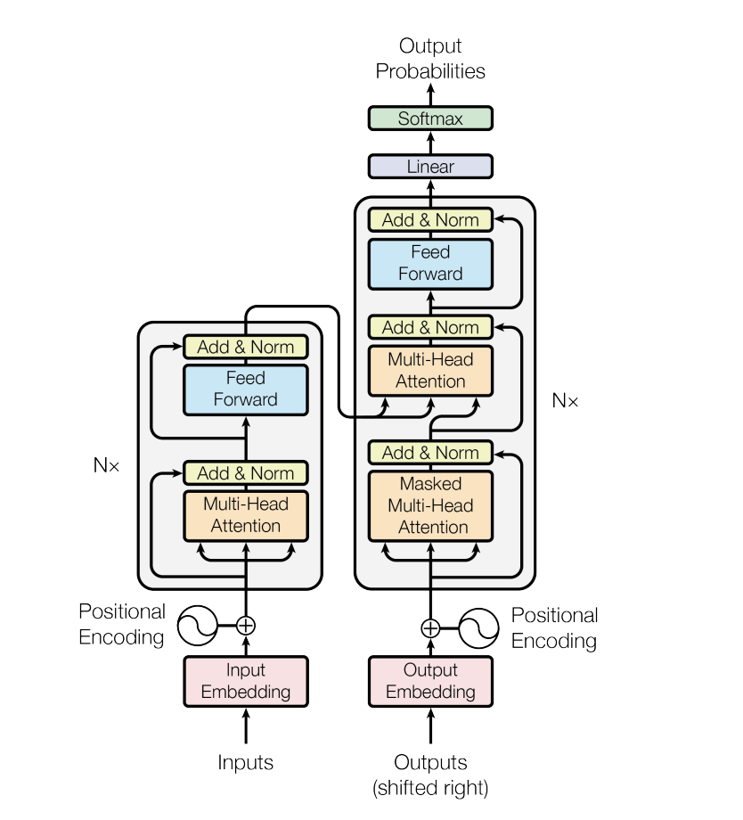

## Section 14: Core Foundations of Gen AI (Context)

- How LLMs work:
  - The transformer (black box of the LLMs) basically only predicts the next token. So when we send a message, it basically loops by:
    - predicting the next token;
    - appending it to the original;
    - checking again the original updated token for the next token prediction

- Implementing a Custom Tokenizer
  - OpenAI has an open library: `tiktoken`
  - So we can create encoder to encode / decode depending on the model

- Transformer Model Architecture
  - 

- Vector embeddings are numerical representations of data points, that capture their meaning and relationships
  - [tensorflow projector](https://projector.tensorflow.org/)

- Positional Encoding is basically creating an array of the vector for setting the proper order

- Self Attention
  - How context might affect the meaning of the word - e.g. River Bank vs Finnancial Bank

- At the end, in Linear, its basically defining the probabilities of each possible token to be the next token, to then define the most probable
